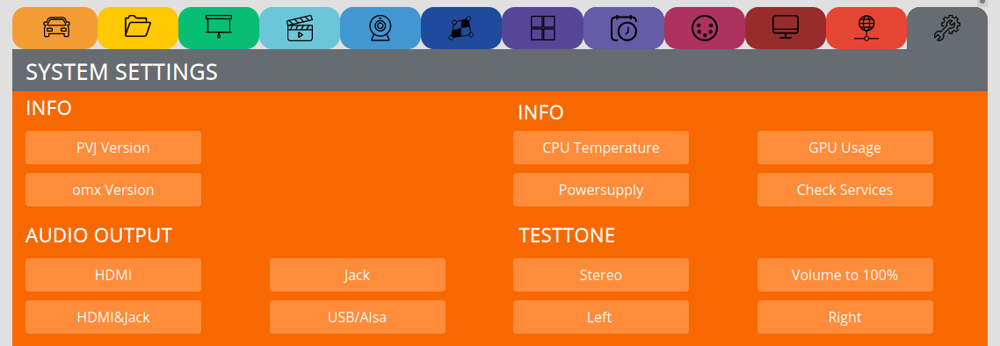

SYSTEM SETTINGS
================

INFO
****

Get some info about the system

AUDIO OUTPUT
************

Select where you want the audio to be played

You can attached USB soundcards, keep in mind that when they are huge, to use an USB powered USB hub.

AUDIO TESTTONE
**************

**Testtones** => Testtones

**Volume 100** => sometimes needed if the USB sound level is low

FIRMWARE
*********

Is for updating stuff:

see video tutorial: https://video.pocketvj.com/AVideo/video/36/pocketvj_rtc_update

if this does not work, use the alternative method: 

FACTORY RESET
*************

Resets to factory state

ACCESS
*******

Access the terminal, used for remote support via chat

ALPHA STUFF
***********

Do not touch!

